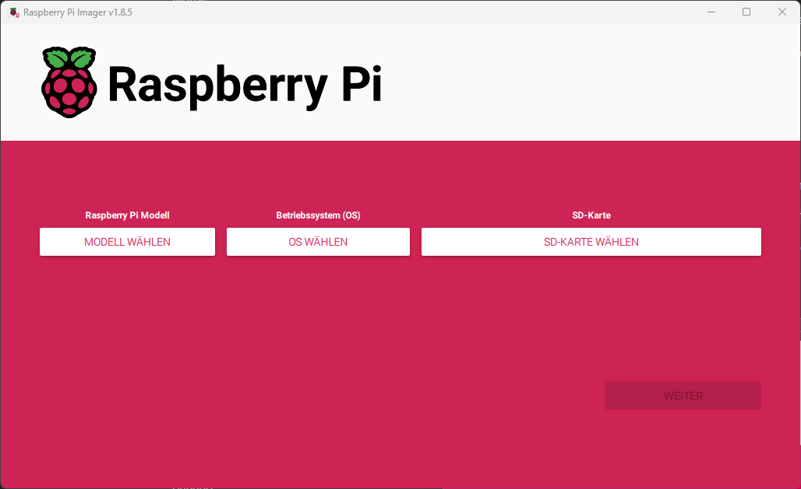
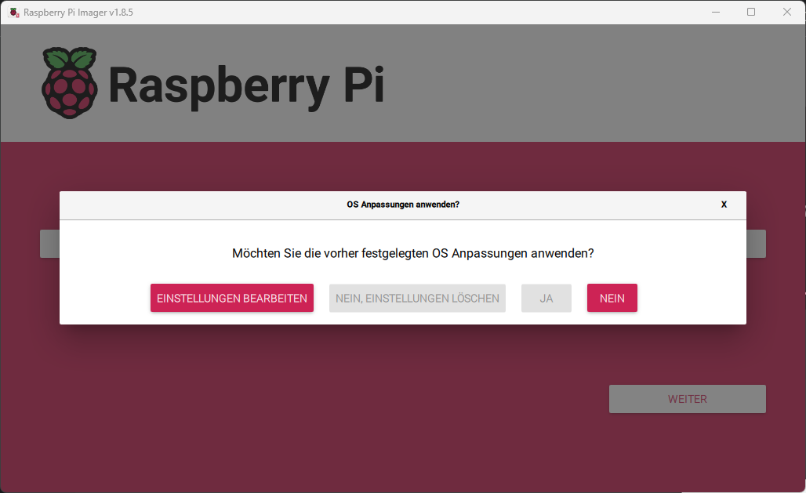
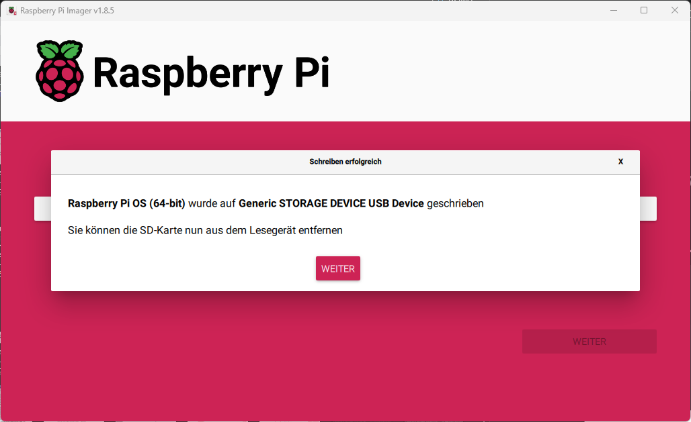
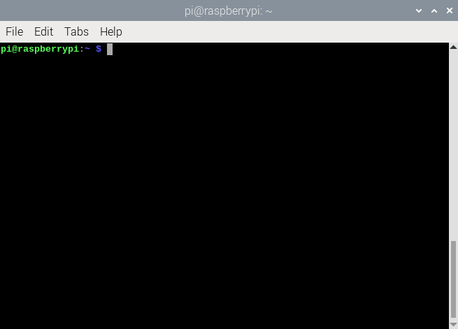

# Raspberry Pi - Eine Einführung in die Welt der Minicomputer

Diese Einführung ist Teil des [Pre-Work-Pakets](../../../collection-it-prwrkpckg).

## Inhaltsverzeichnis
1. [Was ist ein Raspberry Pi?](#was-ist-ein-raspberry-pi)
2. [Erste Schritte](#erste-schritte)
3. [Linux Grundlagen](#linux-grundlagen)
4. [SSH](#ssh)

## Was ist ein Raspberry Pi?
> Raspberry Pi is an affordable way to do something useful, or to do something fun.  
> \- [*Raspberry Pi*](https://www.raspberrypi.com/about/)

Der Raspberry Pi ist ein Einplatinencomputer, also ein voll funktionsfähiger Computer, der aus einer einzigen Platine besteht. Außerdem besitzt der Raspberry Pi einige sogenannte GPIO Pins, an die man verschiedene Sensoren oder Aktoren anschließen kann.

## Erste Schritte
### Material
Um einen Raspberry Pi aufzusetzen, benötigst du Folgendes:
- Raspberry Pi
- Netzteil für den Raspberry Pi
- Micro SD Karte
- Micro SD auf USB Adapter
- Monitor
- Micro HDMI auf HDMI Kabel
- Tastatur, Maus

### Aufsetzen des Raspberry Pi
Bevor du den Raspberry Pi verwenden kannst, musst du zunächst das Betriebssystem Raspberry Pi OS installieren. Lade dir hierzu den [Raspberry Pi Imager](https://www.raspberrypi.com/software) herunter und starte das Programm.

Nun solltest du dieses Fenster vor dir sehen:


Klicke auf "Modell wählen" und wähle den Raspberry Pi 5 aus, klicke dann unter "OS wählen" auf "Raspberry Pi OS (64-bit).  
Zuletzt musst du noch die SD-Karte auswählen, auf die das Betriebssystem geschrieben werden soll. Klicke hierzu auf "SD-Karte wählen", stecke anschließend deine Micro SD Karte mit Hilfe des Micro SD auf USB Adapters in einen USB-Port deines Computers und wähle den Eintrag aus der Liste, der nun erschienen ist.

Nach einem Klick auf die Schaltfläche "Weiter", die nun freigeschaltet sein sollte, erscheint folgender Dialog:


Lehne mit einem Klick auf "Nein" die OS Anpassungen ab und bestätige die Warnung im folgenden Dialog mit "Ja".  
**ACHTUNG**: Hierdurch werden alle Daten auf der SD-Karte überschrieben!

Sobald der folgende Dialog erscheint, war das Schreiben erfolgreich und du kannst den Imager schließen und die Micro SD-Karte aus deinem Computer entfernen.


Stecke nun die Micro SD-Karte in den entsprechenden Slot deines Raspberry Pis und schließe Maus, Tastatur und einen Monitor an. Anschließend kannst du auch die Stromversorgung anschließen, um deinen Pi das erste Mal zu starten. Bei diesem Startvorgang wirst du durch ein automatisches Setup geführt. Lies alle Punkte aufmerksam durch und folge den Anweisungen, um am Ende ein voll funktionsfähiges Betriebssystem zu erhalten.

Solltest du während der Installation auf Probleme gestoßen sein, wirf einen Blick auf den [Getting Started Guide der Raspberry Pi Foundation](https://www.raspberrypi.com/documentation/computers/getting-started.html).


## Linux Grundlagen
Das Betriebssystem, das du auf dem Raspberry Pi installiert hast, ist eine Linux-Distribution, also ein Betriebssystem, das auf dem Linux Kernel basiert. Im Folgenden werden einige Grundlagen vermittelt, die dir bei der Arbeit mit Linux und dem Raspberry Pi helfen.

### Linux Kernel
Bei einem Kernel handelt es sich um den Kern des Betriebssystems. Er ist für die Zusammenarbeit von Hardware und Software verantwortlich. Der Linux Kernel ist, anders als beispielsweise der von Windows, open source.

### Terminal Basics
Auch wenn die meisten Linux-Distributionen heute über eine grafische Benutzeroberfläche verfügen, ist für manche Aufgaben dennoch die Verwendung des Terminals nötig. In Raspberry Pi OS kannst du in der Programmauswahl nach Terminal suchen, um es zu öffnen.  
So sieht das Terminal in Raspberry Pi OS aus:



Um dir den Einstieg zu vereinfachen, findest du im Folgenden eine Übersicht der wichtigsten Befehle. Um sie auszuführen musst du, nachdem du sie eingegeben hast, 'Enter' drücken.

| Befehl | Beschreibung |
| ------ | ------------ |
| `ls` | listet die Inhalte des aktuellen Ordners auf |
| `cd <Verzeichnis>` | wechselt in das angegebene Verzeichnis<br>(`..` für das nächst höhere Verzeichnis, auch Parent-Verzeichnis genannt) |
| `sudo <Befehl>` | führt den angegebenen Befehl mit root-Rechten aus |
| `nano <Datei>` | öffnet einen Texteditor zum Bearbeiten der angegebenen Datei |
| `cat <Datei>` | gibt die Inhalte einer Datei im Terminal aus |
| `curl <URL>` | gibt die Inhalte einer Website im Terminal aus |

### Root-Rechte
Für manche Befehle reichen die Rechte der normalen Benutzer-Accounts nicht aus. Um sie trotzdem ausführen zu können, musst du dich entweder als Benutzer `root` einloggen oder `sudo` vor den Befehl schreiben (dies funktioniert aber nur, wenn dein Account die nötigen Rechte dafür hat).

### Software verwalten
Unter Linux verwendet man meist sogenannte Package Manager, um Software zu installieren, zu deinstallieren und zu updaten. Der Package Manager von Raspberry Pi OS heißt APT. Im Folgenden findest du die wichtigsten Befehle zur Verwaltung von Software.

```bash
# Pakete installieren
sudo apt install <Paket>

# Pakete deinstallieren
sudo apt remove <Paket>

# Alle Pakete aktualisieren
sudo apt update && sudo apt upgrade
```

### Ordnerstruktur
Die Ordnerstruktur von Linux-Systemen ist standardisiert. Im Folgenden werden die Verzeichnisse erklärt, mit denen man als Benutzer am häufigsten arbeitet. [Hier](https://en.wikipedia.org/wiki/Filesystem_Hierarchy_Standard) findest du eine ausführliche Erklärung aller Verzeichnisse.

#### `/`
Dieser Pfad wird als Filesystem-Root bezeichnet. Es ist sozusagen der Ordner, in dem alle anderen Ordner liegen.

#### `/home/<Benutzer>`
Unter diesem Pfad finden sich die Daten des jeweiligen Benutzers. Es handelt sich hauptsächlich um die gespeicherten Dateien, aber auch um individuelle Einstellungen für bestimmte Programme.

#### `/etc`
Hier befinden sich Konfigurationsdateien für das System.

#### `/mnt`
Hier werden Dateisysteme von anderen Datenträgern (z.B. USB-Sticks) temporär gemountet, um auf sie zuzugreifen.

## SSH
Secure Shell (SSH) ist ein Protokoll, das einen sicheren Remote-Zugriff auf einen anderen Computer ermöglicht. In unserem Fall kann es dazu verwendet werden, auf den Raspberry Pi zuzugreifen, ohne einen Bildschirm oder andere Peripherie-Geräte anschließen zu müssen.
SSH öffnet ein Terminalfenster an deinem PC, mit dem du den Remote-Rechner genauso bedienen kannst wie mit einem Terminalfenster, das direkt auf dem anderen Rechner geöffnet wurde.

SSH bietet dir nur eine Kommandozeile ohne grafische Benutzeroberfläche an, was aber für viele Anwendungen ausreicht. Solltest du eine Remote-Verbindung mit grafischer Oberfläche benötigen, findest du [hier](https://www.raspberrypi.com/documentation/computers/remote-access.html) weitere Informationen.

### IP-Adresse herausfinden
Um eine Verbindung zu deinem Raspberry Pi aufbauen zu können, musst du zunächst dessen IP-Adresse herausfinden. Hierzu gibt es viele verschiedene Wege, wobei es am einfachsten ist, folgenden Befehl in ein Terminal auf deinem Raspberry Pi einzugeben:

```bash
hostname -I
```

Weiterere Befehle, die für das Erhalten der IP-Adresse verwendet werden können, sind `ip addr show` und `ifconfig`. Der Text der von diesen Commands ausgegeben wird ist aber komplizierter, als die von `hostname`. Jedoch ist letzteres nicht in jeder Linux-Distribution enthalten, weshalb man die Alternativen kennen sollte.  
Falls man keine Konsolenbefehle verwenden möchte, kann man auch in der Weboberfläche seines Routers die IP-Adressen der einzelnen Geräte nachsehen. Bei der Fritzbox geht das z. B. auf der Seite `fritz.box`.

Solltest du kein Display an deinen Raspberry Pi angeschlossen haben, kannst du alternativ auch die Web-Oberfläche deines Routers verwenden, um über die Geräteliste die entsprechende IP-Adresse zu finden.

### Setup des SSH-Servers
Um von einem anderen Gerät auf deinen Raspberry Pi zugreifen zu können, muss dieser als SSH-Server fungieren. Die nötigen Pakete hierfür sind auf dem Pi schon vorinstalliert, müssen aber noch aktiviert werden.

Hierzu kannst du wieder das Terminal benutzen:

1. Gib den Befehl `sudo raspi-config` ein  
Dieser öffnet das Konfigurations-Tool des Raspberry Pi
2. Wähle `Interface Options` aus
3. Navigiere zu `SSH` und wähle es aus
4. Wähle `Yes` aus
5. Wähle `Ok` aus
6. Wähle `Finish` aus

### Verbindungsaufbau
Nachdem der SSH-Server aktiviert wurde, kannst du von einem anderen Computer aus mit dem folgenden Terminal-Befehl eine Verbindung herstellen:

```
ssh <Benutzer>@<IP>
```

Die IP des Pis hast du in den vorhergehenden Schritten bereits herausgefunden. Solltest du keinen Benutzernamen vergeben haben, versuche es mit dem Nutzer `pi` (das Standard-Passwort ist dann `raspberry`).

Solltest du die Meldung `The authenticity of host <IP> can't be established.` erhalten, bestätige das Fortfahren, indem du `yes` eingibst.

Als Nächstes wirst du noch nach einem Passwort gefragt. Gib es ein und bestätige mit Enter.

Jetzt kannst du das Terminal deines Raspberry Pis auch ganz bequem von einem anderen Computer aus verwenden.
